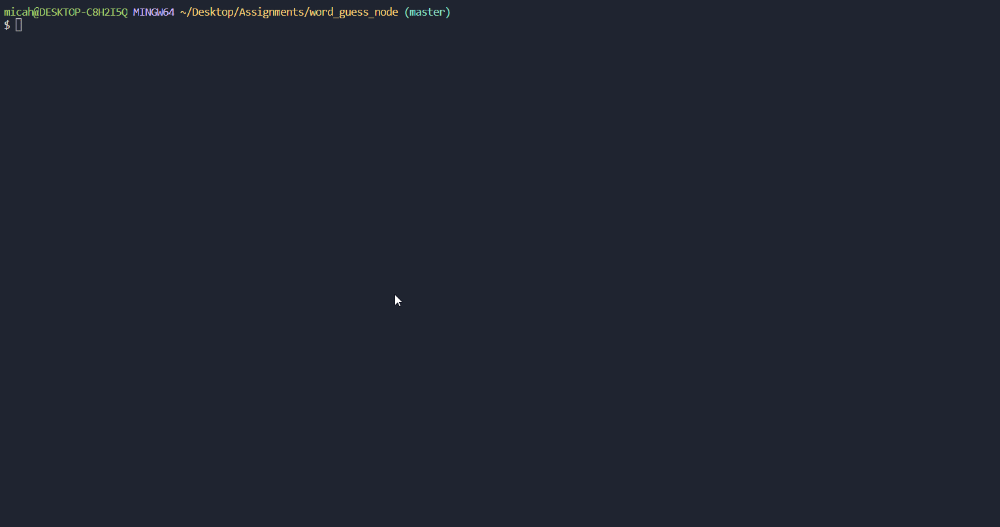

# Constructor Word-Guess

 

## Motive:
The primary motive was to solidify my understandings of the foundational concepts utilizing Node.js and how it works in conjunction with constructors, and API databases.

## Getting Started

:black_small_square: To get started: You will need to have an updated IDE (preferably VS Code), and the latest version of Node.js

### Prerequisites

:black_small_square: IDE: Microsoft Visual Studios 1.37.1 (or higher).
 
:black_small_square: Node.js (Version: 12.9.0 or higher)

## Commands
 

**List of commands:**
 
node index.js -> To start the game in the terminal.
 
When prompted to play another game: Y/n (Press: y or n)

## Deployment

<b>Simply 'git push' the files into GitHub Profile and link repository to BCS.</b>

## Built With:

 
:black_small_square: Microsoft Studios Visual Code (v1.37.1)
 
:black_small_square: Google Chrome
 
:black_small_square: Node.js v12.9.0
 
:black_small_square: ShareX v12.4.1 - Screen Record User Functionality and converts to GIFs
 

## npm Packages Used:
:black_small_square: inquirer v7.0.0
 
:black_small_square: chalk API - For colors in terminal: https://www.npmjs.com/package/chalk
 
:black_small_square: figlet

## Author

**Micah Andres** - [mandres2](https://github.com/mandres2)

## License

<b>This project is licensed under the University of Washington License</b>

## Acknowledgments
*TAs - Catherine Pham, and Trae Shanks*
 
*Teacher - Arron Linton*

## Progress Log:
 
:heavy_check_mark: 9.1 - Review requirements. Established repository, files, and began markdown on README.md
 
:heavy_check_mark: 9.2 - Re-writing code and debugging.
 
:heavy_check_mark: 9.3 -> 9.4 - Debugging and testing.
 
:heavy_check_mark: 9.5- Polishing up application and executing final push for application deployment. 

